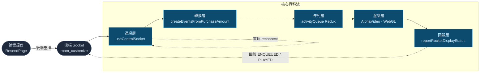
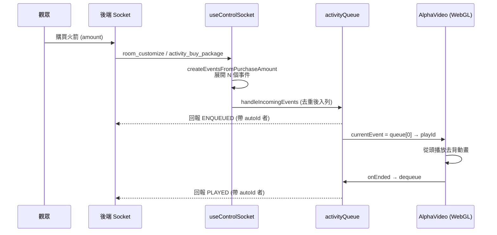
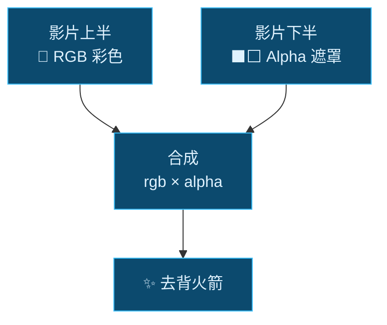
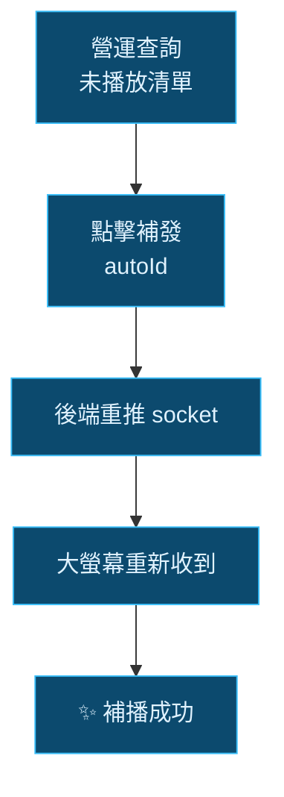
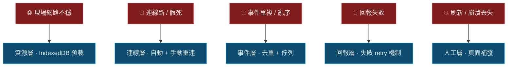

# 線下送禮火箭架構

## 從 Socket 下發到大螢幕 · 資料流與「萬無一失」的多層防護

---
layout: center
class: text-center
---

# 基本流程

<div class="text-2xl leading-relaxed mt-8">
觀眾在直播間<span class="text-sky-400 font-bold">購買火箭</span><br>
後端透過 <span class="text-sky-400 font-bold">WebSocket</span> 推播<br>
大螢幕<span class="text-sky-400 font-bold">即時播放去背火箭動畫</span>並回報播放狀態
</div>

---
layout: section
---

# Part 1 · 架構全貌

一筆火箭如何從 socket 流到大螢幕

---

# 架構全景

五個核心層,加上兩條防護支線:**重連** 與 **補發**



<div class="text-sm opacity-70 mt-4">
五層各司其職,細節留給後面的提問逐一揭開
</div>

---

# 端到端時序:一筆火箭的生命週期



<div class="text-sm opacity-70 mt-2">
這張時序圖是理解後續所有細節的骨架
</div>

---
layout: section
---

# Part 2-A · 核心資料流

它<span class="text-sky-400">怎麼運作</span>

---

# Q1 · 後端怎麼知道推給「哪一台」螢幕?

<div grid="~ cols-2 gap-4">

<div>

### ❓ 問題
大螢幕沒有登入帳號,後端怎麼認得它、怎麼確認該推哪個直播間?

### 💡 解法
**兩隻 API 各拿一半,備齊才連線:**
- `handleWebSocketConfig` → socket URL
- `handleOfficialLiveInfo` → liveId / liveKey / anchorPfid

**雙閘門 `checkLiveInfoReady`**
兩隻 API 都 settled 且資料齊全才連

**身分驗證**
`createWebSocketTicket` 用 liveKey 做 **HMAC-SHA256** 簽出 JWT ticket

</div>

<div>

```js {all|2-3|6-9}
const checkLiveInfoReady = () => {
  const isReady =
    Boolean(controlSocketUrl && liveId && liveKey && anchorPfid)
  const isSettled = (s) =>
    s === SUCCESS || s === FAILURE
  const isAllSettled =
    isSettled(webSocketConfigStatus) &&
    isSettled(liveInfoStatus)
  // 都結束了卻沒齊 → 發通知
  if (isAllSettled && !isReady)
    sendNotification(...'liveInfoNotReady')
  return isReady
}
```

</div>

</div>

<div class="text-sm opacity-60 mt-2">🪝 那一次買 10 隻,後端是送一包還是十包?</div>

---

# Q2 · 一次買 10 隻火箭,前端怎麼處理?

<div grid="~ cols-2 gap-4">

<div>

### ❓ 問題
後端用 `amount` 表示「一次買 N 隻」(1 或 10),畫面卻要一隻一隻播。

### 💡 解法
`createEventsFromPurchaseAmount` 把一包**展開成 N 個獨立事件**:

- **`eventId`** — 每隻唯一識別(去重 + remount 用)
- **`autoId`** — 只掛在**最後一隻**
  → 連發 10 隻,只在全部播完時回報一次

</div>

<div>

```js {all|5-7}
const expandByAmount = ({ baseEvent, amount, id }) =>
  Array.from({ length: amount }).map((_, i, arr) => ({
    ...baseEvent,
    eventId: `${id}-${i + 1}`,
    // 最後一個才掛 autoId,
    // 用來 callback 通知後端已全數播畢
    ...(i === arr.length - 1 && { autoId: id }),
  }))
```

<div class="mt-4 text-sm">

| 欄位 | 用途 |
|---|---|
| `eventId` | 唯一識別、去重、動畫 remount |
| `autoId` | 批次回報的「結算點」 |

</div>

</div>

</div>

<div class="text-sm opacity-60 mt-2">🪝 socket 瞬間湧入十幾筆,但畫面只能一隻一隻播?</div>

---

# Q3 · 瞬間湧入十幾筆,只能一隻一隻播?

<div grid="~ cols-2 gap-4">

<div>

### ❓ 問題
熱門直播間 socket 可能瞬間湧入大量購買,但火箭動畫必須**循序、逐一**播放。

### 💡 解法
Redux `activityQueue` 當**緩衝佇列**:
- **削峰** — 湧入的事件先排隊
- **保序** — FIFO 依序播放
- `currentEvent = queue[0]` 永遠指向當前播放

播畢 `dequeueEvent()` 出列,下一隻自動遞補。

</div>

<div>

```js
const slice = createSlice({
  name: 'activityQueue',
  initialState: { queue: [] },
  reducers: {
    enqueueEvent: (s, { payload }) =>
      { s.queue.push(...payload) },
    dequeueEvent: (s) =>
      { s.queue.shift() },
  },
})
```

<div class="mt-4 p-3 rounded bg-sky-900/30 text-sm">
💡 佇列存在 <b>Redux 記憶體</b> — 這個特性後面講「刷新會丟失」時很關鍵
</div>

</div>

</div>

<div class="text-sm opacity-60 mt-2">🪝 mp4 沒有透明通道,怎麼在背景影片上疊出去背火箭?</div>

---

# Q4 · mp4 沒有透明通道,怎麼疊去背火箭?

<div grid="~ cols-2 gap-8" class="items-center">

<div>

### ❓ 問題
mp4 不支援 alpha 透明通道,但火箭必須去背疊在背景影片上。

### 💡 解法:**上彩色 / 下遮罩**
把透明資訊「藏」在影片裡:
- 影片**上半部** = 火箭彩色 (RGB)
- 影片**下半部** = alpha 遮罩 (黑=透明 / 白=不透明)

播放時取兩半**合成**:用下半的亮度當作上半的透明度 → 還原出去背火箭。

</div>

<div class="text-center">



<div class="text-xs opacity-60 mt-3">
合成這一步「在哪做、怎麼做」<br>就是下一頁的重頭戲
</div>

</div>

</div>

---
layout: center
class: text-center
---

# Q5

## 為什麼舊版<span class="text-red-400">嚴重卡頓</span>,<br>改 WebGL 就<span class="text-sky-400">解決了</span>?

<div class="mt-8 opacity-70">
關鍵在合成的步驟
</div>

---

# 舊版做法:Canvas 2D · 每一幀都卡死主執行緒

```js {all|1|2-3|5-7|9}
buffer.drawImage(video, 0, 0, ...)                      // 影片畫到 buffer canvas
const image     = buffer.getImageData(0, 0, w, h)       // ① GPU→CPU 把像素「讀回來」(彩色半)
const alphaData = buffer.getImageData(0, h, w, h).data  // ② 再讀一次 (alpha 半)

for (let i = 3; i < len; i += 4) {                      // ③ JS 逐像素迴圈
  imageData[i] = alphaData[i - 1]                        //    1080p ≈ 兩百萬像素 / 幀
}

output.putImageData(image, ...)                         // ④ CPU→GPU 再「寫回去」
```

<div grid="~ cols-3 gap-3" class="mt-6">

<div class="p-3 rounded bg-red-900/30">
<div class="text-red-400 font-bold">① ② 像素讀回</div>
<div class="text-sm opacity-80">getImageData 是<b>同步</b> GPU→CPU 搬運,強制管線停等</div>
</div>

<div class="p-3 rounded bg-red-900/30">
<div class="text-red-400 font-bold">③ JS 逐像素</div>
<div class="text-sm opacity-80">單執行緒跑<b>兩百萬次</b>迴圈,每幀重來</div>
</div>

<div class="p-3 rounded bg-red-900/30">
<div class="text-red-400 font-bold">④ 寫回</div>
<div class="text-sm opacity-80">再一次 CPU→GPU 同步搬運</div>
</div>

</div>

<div class="mt-5 text-center text-lg">
👉 全部塞在<b class="text-red-400">主執行緒</b>,每幀做一次 → 動畫掉幀、整個 UI 凍結
</div>

---

# 新版做法:WebGL · 像素不經過 CPU

```js {all|2|4|6}
// 影片畫格「直傳」成 GPU texture — GPU→GPU,不經 CPU
gl.texSubImage2D(gl.TEXTURE_2D, 0, 0, 0, gl.RGBA, gl.UNSIGNED_BYTE, video)
// 叫 GPU 畫全螢幕四邊形
gl.drawArrays(gl.TRIANGLE_STRIP, 0, 4)
// fragment shader 在 GPU 上「平行」對每個像素合成 rgb × alpha
//   gl_FragColor = vec4(color.rgb * alpha, alpha)
```

<div grid="~ cols-2 gap-4" class="mt-6">

<div class="p-4 rounded bg-emerald-900/30">
<div class="text-emerald-400 font-bold mb-1">關鍵差異</div>
<ul class="text-sm leading-relaxed">
<li>影片畫格 → texture <b>直傳 GPU</b>,像素不落地到 CPU</li>
<li>合成由 <b>fragment shader</b> 在 GPU 上<b>平行</b>處理每個像素</li>
<li>主執行緒只下「畫」的指令 → <b>解放</b></li>
</ul>
</div>

<div class="p-4 rounded bg-emerald-900/30">
<div class="text-emerald-400 font-bold mb-1">加碼:rVFC 取代土法節流</div>
<ul class="text-sm leading-relaxed">
<li>舊版用 <code>Date.now()</code> 算 fps 硬節流,會誤差</li>
<li>新版 <code>requestVideoFrameCallback</code>:<b>有新影格才畫</b></li>
<li>不支援時 fallback 到 rAF + currentTime 去重</li>
</ul>
</div>

</div>

---
layout: center
class: text-center
---

# 一個比喻

<div grid="~ cols-2 gap-8" class="mt-8">

<div class="p-6 rounded bg-red-900/20">
<div class="text-3xl mb-2">🧱</div>
<div class="text-red-400 font-bold text-xl">舊版 = 一個工人搬磚</div>
<div class="mt-3 opacity-80">把每塊磚(像素)從倉庫(GPU)搬到桌上(CPU),一塊塊處理完再搬回去 —— 兩百萬塊,每幀一輪</div>
</div>

<div class="p-6 rounded bg-emerald-900/20">
<div class="text-3xl mb-2">🏭</div>
<div class="text-emerald-400 font-bold text-xl">新版 = GPU 平行工廠</div>
<div class="mt-3 opacity-80">磚塊留在原地(GPU),幾千條產線(shader core)同時處理 —— 工人(主執行緒)只負責下指令</div>
</div>

</div>

---
layout: section
---

# Part 2-B · 可靠性與多層防護

怎麼確保<span class="text-sky-400">萬無一失</span>

<div class="mt-6 text-base opacity-80">
資源先備好 → 自動擋(去重) → 自動修(重連 / 重試) → 人工(補發)
</div>

---

# Q6 · 同一隻火箭湧入多次?播完會重複回報嗎?

### 💡 「精準一次」由四道關卡共同保證

<div grid="~ cols-2 gap-4" class="mt-4">

<div>

```js {all|3-5}
// ① 入列去重:比對當前 queue 的 eventId
const handleIncomingEvents = (events) => (d, getState) => {
  const existingIds = new Set(queue.map((e) => e.eventId))
  const newEvents = events.filter(
    (e) => !existingIds.has(e.eventId))
  if (newEvents.length === 0) return
  dispatch(enqueueEvent(newEvents))
}
```

```js
// ④ 併發回報去重:autoId:status 為 key
const rocketStatusInFlight = new Set()
if (rocketStatusInFlight.has(`${autoId}:${status}`)) return
```

</div>

<div class="text-sm leading-relaxed">

| 關卡 | 擋掉什麼 |
|---|---|
| ① **eventId 去重** | 同一事件重送 / 重連重推 |
| ② **video `ended`** | 每次播放只觸發一次 |
| ③ **autoId 結算** | 批次 10 隻只回報一次 |
| ④ **in-flight Set** | 併發 dispatch 重複回報 |

<div class="mt-4 p-3 rounded bg-sky-900/30">
四道疊起來 → <b>同一筆購買,只播應播的次數、只回報一次</b>
</div>

</div>

</div>

<div class="text-sm opacity-60 mt-2">🪝 但這些都假設「畫面活著」—— 網路斷了、資源抓不到呢?</div>

---

# Q7 · 背景影片常駐播放,現場網路不穩抓不到?

<div grid="~ cols-2 gap-4">

<div>

### ❓ 問題
背景影片是**常駐 loop 播放**,現場網路一不穩就抓不到資源 → 整個畫面開天窗。

### 💡 解法:`useVideoCache` 預載進 **IndexedDB**
一旦快取命中,**完全脫離網路**從本地播。

<div class="mt-3 p-3 rounded bg-sky-900/30 text-sm">
🛡️ 資源層防護:把「依賴現場網路」變成「依賴一次成功的預載」
</div>

</div>

<div class="text-sm leading-relaxed">

**分段下載(10MB / 段,並發 3)**
避免大型 response 在 HTTP/2 被中間層(nginx / LB)截斷;429 退避重試(1s / 2s / 4s)

**ETag 版本比對**
HEAD 拿 etag + content-length,相同才沿用 cache

**降級鏈(層層退守)**
```text
HEAD 失敗 → 有 cache 就先播(至少播得出來)
整體失敗 → fallback 原始 S3 URL
```

</div>

</div>

<div class="text-sm opacity-60 mt-2">🪝 資源備好了,那連線本身斷了怎麼辦?</div>

---

# Q8 · 網路不穩 / 後端 socket 建立失敗,畫面會死掉嗎?

<div grid="~ cols-2 gap-4">

<div>

### 🤖 第一層:自動修復
- **socket.io 自動重連** — 最多 10 次
- **pong timeout 18s** — 偵測「假死連線」(連著但收不到封包)
- **`online` 事件** — 網路恢復自動重連

```js
socket.io.engine.on('ping', () => {
  pongTimerRef.current = setTimeout(() => {
    sendNotification(...'liveConnectTimeout')
  }, PONG_TIMEOUT_MS) // 18s
})
```

</div>

<div>

### 🖐️ 第二層:手動重連按鈕(右上角)
```js
const reconnect = () => {
  disconnect()
  dispatch(handleOfficialLiveInfo()) // 重抓
  connect()                           // 重連
}
```

<div class="mt-3 p-3 rounded bg-amber-900/30 text-sm">
⚠️ <b>刻意「不刷新頁面」</b><br>
刷新 = Redux 記憶體 queue 全清空<br>
= <b>排隊中的火箭全部丟失</b><br>
所以做成原地重連,保住佇列
</div>

</div>

</div>

<div class="text-sm opacity-60 mt-2">🪝 連線顧好了,那「回報後端」這段為什麼我刻意不用 createApiService?</div>

---

# Q9 · 回報狀態,為什麼用 plain thunk 而非 createApiService?

<div grid="~ cols-2 gap-4">

<div>

### createApiService 適合
> 抓資料 → 存進 slice → 渲染 loading / error UI

一次性、UI 綁定、單一狀態。

### 但「回報播放狀態」不一樣
- **fire-and-forget** 背景副作用,結果不渲染
- **多隻火箭併發**回報
- 需要**自訂 backoff 重試**(1s, 2s × 3)
- 需要 **in-flight 去重**
- **不該存 apiStatus** — 併發回報會互相覆蓋,且根本不需要 loading / error

</div>

<div>

```js {all|6-9}
const handleUpdateRocketDisplayStatus =
  ({ autoId, status }) => async (_, getState) => {
    if (rocketStatusInFlight.has(key)) return
    rocketStatusInFlight.add(key)

    const attemptReport = async (attempt = 0) => {
      const res = await updateRocketDisplayStatus(...)
      if (res.data?.status) return            // 成功
      if (attempt === MAX_RETRY - 1) { notify(); return }
      await sleep(1000 * 2 ** attempt)         // backoff
      await attemptReport(attempt + 1)         // 重試
    }
    // ...finally: rocketStatusInFlight.delete(key)
  }
```

<div class="mt-3 p-3 rounded bg-sky-900/30 text-sm">
💡 用對工具:<b>UI 狀態</b>用 createApiService,<b>背景副作用 + 自訂控制</b>用 plain thunk
</div>

</div>

</div>

<div class="text-sm opacity-60 mt-2">🪝 萬一上面全失守,火箭真的漏播了呢?</div>

---

# Q10 · 火箭真的漏播了 —— 人工補發機制

<div grid="~ cols-2 gap-6">

<div>

### ❓ 問題
刷新、崩潰、長時間斷網 —— 火箭真的丟了,自動機制救不回。

### 💡 解法:獨立 **ResendPage** 控台
營運的最後一道防線:

1. **總覽統計** — 未播 / 已播 / 已重送 / 已入列
2. **查購買紀錄** — 輸入送禮 id,列出每筆 `isPlay`
3. **一鍵補發** — `handleReSendActivityEvent(autoId)`
   → 後端**重推** socket → 螢幕重新收到並播放

</div>

<div class="text-center">



<div class="mt-4 p-3 rounded bg-sky-900/30 text-sm text-left">
補發重推的事件帶相同 eventId<br>
→ 若畫面還在、queue 沒丟,<b>去重會自動吸收重疊</b>
</div>

</div>

</div>

---

# 穿插 · 關鍵通知

<div class="mt-4 text-base opacity-80">不全列,挑幾個有代表性的</div>

<div grid="~ cols-2 gap-4" class="mt-6">

<div class="p-4 rounded bg-slate-800/50">
<div class="text-sky-400 font-mono font-bold">liveConnectTimeout</div>
<div class="text-sm mt-1 opacity-80">pong 逾時 → 偵測到「連著卻收不到封包」的假死連線</div>
</div>

<div class="p-4 rounded bg-slate-800/50">
<div class="text-sky-400 font-mono font-bold">liveInfoNotReady</div>
<div class="text-sm mt-1 opacity-80">兩隻 API 都結束卻資料不齊 → 前置條件出問題</div>
</div>

<div class="p-4 rounded bg-slate-800/50">
<div class="text-sky-400 font-mono font-bold">enqueueCallbackFailed</div>
<div class="text-sm mt-1 opacity-80">入列回報後端失敗 → 提示營運留意 / 補發</div>
</div>

<div class="p-4 rounded bg-slate-800/50">
<div class="text-sky-400 font-mono font-bold">playEndedCallbackFailed</div>
<div class="text-sm mt-1 opacity-80">播畢回報失敗 → 同上,可能需補發</div>
</div>

</div>

---
layout: section
---

# Part 3 · 架構優化建議

目前可運作,但<span class="text-sky-400">值得再想</span> —— 留給會後討論

---

# 三個值得討論的優化方向

<div class="space-y-4 mt-4">

<div class="p-4 rounded bg-sky-900/30 border-l-4 border-sky-400">
<div class="font-bold text-sky-300">重點:重連 / 刷新後「自動補播」未播火箭</div>
<div class="text-sm mt-1 opacity-90">
連上後主動向後端拉「未播放清單」自動重推;eventId 去重吸收與現有 queue 的重疊;後端依 <code>isPlay</code> 只推真正未播者。
<b>→ 大幅減少人工補發(現況:全靠手動 ResendPage)</b>
</div>
</div>

<div class="p-4 rounded bg-slate-800/50 border-l-4 border-slate-500">
<div class="font-bold">記憶體佇列持久化</div>
<div class="text-sm mt-1 opacity-90">
queue 存在 Redux(RAM),刷新 / 崩潰即歸零、未播火箭全丟。可持久化到 localStorage / IndexedDB,刷新自動還原(與上一點互補)。
</div>
</div>

<div class="p-4 rounded bg-slate-800/50 border-l-4 border-slate-500">
<div class="font-bold">回報權責與競態</div>
<div class="text-sm mt-1 opacity-90">
<code>withReport</code> 由前端決定,多台同接會<b>各自都回報</b>,<code>rocketStatusInFlight</code> 跨裝置防不了。建議後端發放<b>回報權杖 / 設備白名單</b>,或伺服器端對 <code>autoId+status</code> 做<b>冪等</b>。
</div>
</div>

</div>

---
layout: center
---

# 總結 · 五層防護,各接一種故障



---
layout: center
class: text-center
---

# 設計亮點回顧

<div grid="~ cols-2 gap-3" class="mt-6 text-left text-sm">

<div class="p-3 rounded bg-slate-800/50">⚡ <b>WebGL 去背</b> — 像素不經 CPU,主執行緒解放</div>
<div class="p-3 rounded bg-slate-800/50">🔢 <b>autoId 批次回報</b> — 10 隻只結算一次</div>
<div class="p-3 rounded bg-slate-800/50">🚦 <b>佇列湧入事件</b> — 先進先出，確保不重複</div>
<div class="p-3 rounded bg-slate-800/50">🛡️ <b>IndexedDB 預載</b> — 斷網也撐得住</div>
<div class="p-3 rounded bg-slate-800/50">🔁 <b>多層重連 / 重試</b> — 自動修復</div>
<div class="p-3 rounded bg-slate-800/50">🧰 <b>補發</b> — 人工最後防線</div>

</div>
